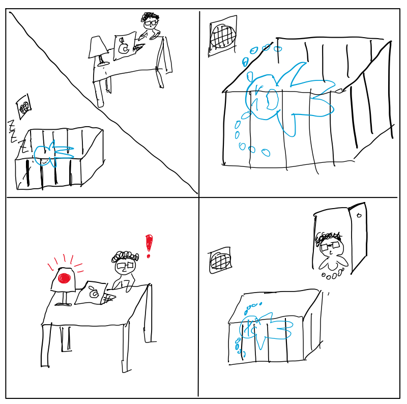
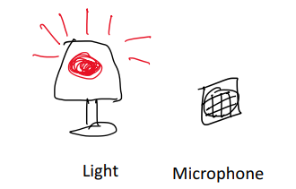

# Staging Interaction

In the original stage production of Peter Pan, Tinker Bell was represented by a darting light created by a small handheld mirror off-stage, reflecting a little circle of light from a powerful lamp. Tinkerbell communicates her presence through this light to the other characters. See more info [here](https://en.wikipedia.org/wiki/Tinker_Bell). 

There is no actor that plays Tinkerbell--her existence in the play comes from the interactions that the other characters have with her.

For lab this week, we draw on this and other inspirations from theatre to stage interactions with a device where the main mode of display/output for the interactive device you are designing is lighting. You will plot the interaction with a storyboard, and use your computer and a smartphone to experiment with what the interactions will look and feel like. 

_Make sure you read all the instructions and understand the whole of the laboratory activity before starting!_

## Prep

### To start the semester, you will need:
1. Set up your own Github "Lab Hub" repository to keep all you work in record by [following these instructions](https://github.com/FAR-Lab/Developing-and-Designing-Interactive-Devices/blob/2021Fall/readings/Submitting%20Labs.md).
2. Set up the README.md for your Hub repository (for instance, so that it has your name and points to your own Lab 1) and [learn how to](https://guides.github.com/features/mastering-markdown/) organize and post links to your submissions on your README.md so we can find them easily.
3. (extra: Learn about what exactly Git is from [here](https://git-scm.com/book/en/v2/Getting-Started-What-is-Git%3F).)

### For this lab, you will need:
1. Paper
2. Markers/ Pens
3. Scissors
4. Smart Phone -- The main required feature is that the phone needs to have a browser and display a webpage.
5. Computer -- We will use your computer to host a webpage which also features controls.
6. Found objects and materials -- You will have to costume your phone so that it looks like some other devices. These materials can include doll clothes, a paper lantern, a bottle, human clothes, a pillow case, etc. Be creative!

### Deliverables for this lab are: 
1. Storyboard
1. Sketches/photos of costumed device
1. Any reflections you have on the process
1. Video sketch of the prototyped interaction
1. Submit the items above in the lab1 folder of your class [Github page], either as links or uploaded files. Each group member should post their own copy of the work to their own Lab Hub, even if some of the work is the same from each person in the group.

### The Report
This README.md page in your own repository should be edited to include the work you have done (the deliverables mentioned above). Following the format below, you can delete everything but the headers and the sections between the **stars**. Write the answers to the questions under the starred sentences. Include any material that explains what you did in this lab hub folder, and link it in your README.md for the lab.

## Lab Overview
For this assignment, you are going to:

A) [Plan](#part-a-plan) 

B) [Act out the interaction](#part-b-act-out-the-interaction) 

C) [Prototype the device](#part-c-prototype-the-device)

D) [Wizard the device](#part-d-wizard-the-device) 

E) [Costume the device](#part-e-costume-the-device)

F) [Record the interaction](#part-f-record)

Labs are due on Mondays. Make sure this page is linked to on your main class hub page.

## Part A. Plan 

To stage the interaction with your interactive device, think about:

_Setting:_ Where is this interaction happening? (e.g., a jungle, the kitchen) When is it happening?

_Players:_ Who is involved in the interaction? Who else is there? If you reflect on the design of current day interactive devices like the Amazon Alexa, it’s clear they didn’t take into account people who had roommates, or the presence of children. Think through all the people who are in the setting.

_Activity:_ What is happening between the actors?

_Goals:_ What are the goals of each player? (e.g., jumping to a tree, opening the fridge). 

The interactive device can be anything *except* a computer, a tablet computer or a smartphone, but the main way it interacts needs to be using light.

\*\***Describe your setting, players, activity and goals here.**\*\*

Setting: Two different rooms in a house

Players: Parent who is working from home and a baby

Activity: The baby is crying in a room and the parent is on a zoom meeting in a different room.

Goals: Instead of the parent getting a loud noise on the baby monitor, a light source flashes alerting the parents of the child crying. This can help parents who are working from home to monitor their babies in a non-intrusive way using light

Sketch a storyboard of the interactions you are planning. It does not need to be perfect, but must get across the behavior of the interactive device and the other characters in the scene. 

\*\***Include a picture of your storyboard here**\*\*

Present your idea to the other people in your breakout room. You can just get feedback from one another or you can work together on the other parts of the lab.

\*\***Summarize feedback you got here.**\*\*

Xiaotian Liu (xl467):
Would be a very useful tool for WFH mothers! The illustration is cute and clear. If empowered by a sensitive babyface detector, I believe the device can really help to avoid unexpected meeting interuptions.

Jueying Li (jl2852):
I think that this idea is a really brilliant one. It solves the problem that a parent has to be in the same room as the child while working. Working with a child beside must be very distracting and therefore improvements are need. The status of the child is represented with the light signal. Therefore, the parent will not need to check the child's status frequently but only check the child when the signal turns red(meaning the child is crying). This design is both straightforward and creative. It is of real-world significance because it helps to unurden the caregivers, especially the working parents. One potential improvement may be to give the light more colors to indicated different status of the child. For example, there are currently sensors that can detect whether people are asleep or wake, and using this sensor, the system can not only show the child's status as crying or not, but also sleeping or awake. Overall, I really like the design and looking forward to seeing the future improvements.

Roommates: The idea is great and interesting. Could be useful to the parents given the current scenario. Also try to communicate the urgency or intensity of the baby’s crying to the parent.

## Part B. Act out the Interaction

Try physically acting out the interaction you planned. For now, you can just pretend the device is doing the things you’ve scripted for it. 

\*\***Are there things that seemed better on paper than acted out?**\*\*

The initial plan involved using the room light as the alerting light. But the intensity of that is very low especially during the day. So we shifted towards a table/bedside lamp.

It’s hard to act out and record scenes happening in separate rooms at the same time, which is easy to deliver on paper.

\*\***Are there new ideas that occur to you or your collaborators that come up from the acting?**\*\*

We decided to place the mobile phone controlled using tinkerbelle inside the table lamp instead of using the light bulb in the lamp itself as a lightsource.

The light source should be placed somewhere more visible.

Changing the intensity of the light based on the baby’s volume could be done usng other light sources like smart lighting.

## Part C. Prototype the device

You will be using your smartphone as a stand-in for the device you are prototyping. You will use the browser of your smartphone to act as a “light” and use a remote control interface to remotely change the light on that device. 

Code for the "Tinkerbelle" tool, and instructions for setting up the server and your phone are [here](https://github.com/FAR-Lab/tinkerbelle).

We invented this tool for this lab! 

If you run into technical issues with this tool, you can also use a light switch, dimmer, etc. that you can manually or remotely control.

\*\***Give us feedback on Tinkerbelle.**\*\*

Tinkerbelle works great with colour changing and the interaction is seamless. We hope it can include features such as blinking and gradual variation of intensity too. 

## Part D. Wizard the device
Take a little time to set up the wizarding set-up that allows for someone to remotely control the device while someone acts with it. Hint: You can use Zoom to record videos, and you can pin someone’s video feed if that is the scene which you want to record. 

\*\***Include your first attempts at recording the set-up video here.**\*\*

Now, change the goal within the same setting, and update the interaction with the paper prototype. 

\*\***Show the follow-up work here.**\*\*

https://user-images.githubusercontent.com/50896698/132270679-29687188-1d09-42b7-85cc-d06e3f96fcd1.MP4

## Part E. Costume the device

Only now should you start worrying about what the device should look like. Develop a costume so that you can use your phone as this device.

Think about the setting of the device: is the environment a place where the device could overheat? Is water a danger? Does it need to have bright colors in an emergency setting?

\*\***Include sketches of what your device might look like here.**\*\*

\*\***What concerns or opportunities are influencing the way you've designed the device to look?**\*\*

As we understood from the acting out step, the communication has to be equally effective both during the day and at night. So we decided to use the bedside lamp. Also a better alternative to the device would be a smart lamp controlled again by the sound of the baby’s noise.

## Part F. Record

\*\***Take a video of your prototyped interaction.**\*\*

\*\***Please indicate anyone you collaborated with on this Lab.**\*\*
Be generous in acknowledging their contributions! And also recognizing any other influences (e.g. from YouTube, Github, Twitter) that informed your design. 

I collaborated with Neha Manjunath(nm468), Yehao Zhang(yz2444) and Zhengxing Xue(zx252).

# Staging Interaction, Part 2 

This describes the second week's work for this lab activity.

## Prep (to be done before Lab on Wednesday)

You will be assigned three partners from another group. Go to their github pages, view their videos, and provide them with reactions, suggestions & feedback: explain to them what you saw happening in their video. Guess the scene and the goals of the character. Ask them about anything that wasn’t clear. 

\*\***Summarize feedback from your partners here.**\*\*

## Make it your own

Do last week’s assignment again, but this time: 
1) It doesn’t have to (just) use light, 
2) You can use any modality (e.g., vibration, sound) to prototype the behaviors! Again, be creative!
3) We will be grading with an emphasis on creativity. 

\*\***Document everything here. (Particularly, we would like to see the storyboard and video, although photos of the prototype are also great.)**\*\*
